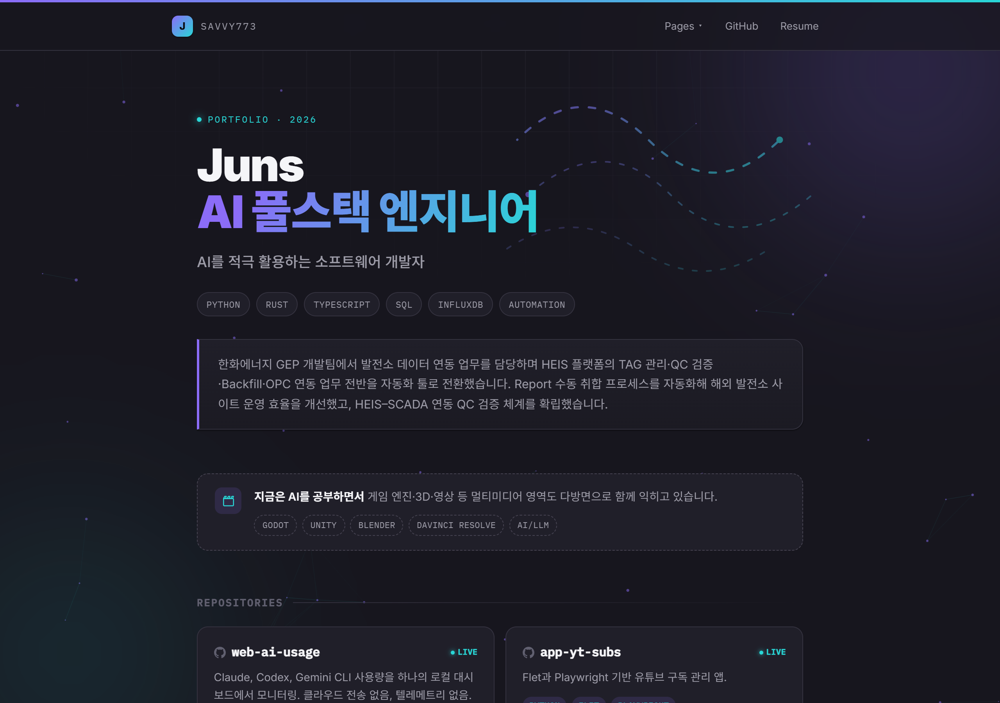

<div align="center">

# Juns — Portfolio

**AI 풀스택 엔지니어 Juns의 개인 포트폴리오**

[](https://savvy773.github.io/)
[](#)
[](#)



</div>

<br>

실제 사내 개발 문서(가이드, 인수인계 보고서 등)를 익명화해 개발 과정의 발자취로 기록하고, 진행 중인 오픈소스 프로젝트를 함께 소개하는 **1페이지 포트폴리오**입니다.

## Live

| | |
|---|---|
| **Site** | https://savvy773.github.io/ |
| **Repo** | https://github.com/savvy773/savvy773.github.io |

## Highlights

- 프레임워크·빌드 도구 없이 **순수 HTML / CSS / JS** (빌드리스)
- 네이티브 **`<dialog>` + iframe** 모달 — 문서·데모를 페이지 이탈 없이 미리보기
- **파스텔 다크** UI + CSS 오로라·원근 격자 배경
- **Canvas 2D Effect** (로고 옆 Effect 독 · 단축키 `1`–`7`)
  - 비 · 눈 · 빗방울 · 물결 · 불꽃 · 우주 · 문샷
- GPU 절약: 낮은 해상도·FPS, 소량 파티클, idle freeze, `prefers-reduced-motion` 대응
- 모바일: safe-area, 터치 hover 완화, 모달 풀스크린, FX 설정 축소

## Currently Learning

- **Godot / Unity** — 게임 엔진 기초 및 인터랙티브 콘텐츠
- **DaVinci Resolve** — 영상 편집·컬러 그레이딩

## Sections

| | |
|---|---|
| **Repositories** | 오픈소스·데모 (web-ai-usage, app-yt-subs, dpi-bye, happycomms 등) |
| **Journey** | HEIS Tool, OPC-ISL, 인수인계, SSH 보안 등 개발 여정 문서 |
| **Resume** | 모달로 바로 보는 이력서 (`resume/resume.html`) |

## Structure

```text
├── index.html          # 마크업·메타
├── css/site.css        # 테마·레이아웃·배경
├── js/
│   ├── effects.js      # Canvas FX 엔진
│   └── app.js          # 네비·모달·reveal·타임라인
├── journey/            # Journey HTML 문서
├── resume/             # 이력서
└── docs/tech-stack.md  # 기술 상세
```

## Local

```bash
npx --yes serve .
```

브라우저에서 루트를 열고, Effect 독 또는 숫자 키 `1`–`7`로 배경 모드를 바꿀 수 있습니다.

## Docs

- [기술 스택 상세](docs/tech-stack.md)

## License

Personal portfolio. Sample / anonymized work docs. © Juns
